# RBlind-Lemmy-Themes

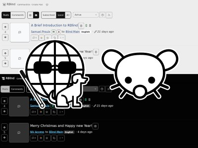

The RBlind Lemmy Themes `RBlind-Dark.css` and `RBlind-Light.css` are open source themes developed for the Lemmy instance [RBlind](https://rblind.com/), run by [OurBlind](https://ourblind.com/). The themes aim to be accessible to the vision impaired and blind community.

These themes are in alpha and currently being tested and developed further with feedback from the community.

This repository is being hosted on [Github (RBlind-Lemmy-Themes)](https://github.com/travis-jeans/RBlind-Lemmy-Themes) and [Codeberg (RBlind-Lemmy-Themes)](https://codeberg.org/travis-jeans/RBlind-Lemmy-Themes). The reasons are explained in [About The Repositories](#about-the-repositories).

## Contents

1. [About OurBlind](#about-our-blind)
2. [Theme Previews](#theme-previews)
   1. [RBlind Dark Theme](#rblind-dark-theme)
   2. [RBlind Light Theme](#rblind-light-theme)
3. [Background](#background)
4. [Features](#features)
5. [Limitations](#limitations)
6. [License](#license)
7. [Installation](#installation)
   1. [For Lemmy Administrators](#for-lemmy-administrators)
   2. [For Lemmy Users](#for-lemmy-users)
8. [For Designers](#for-designers)
   1. [Colours](#colours)
   2. [Layout](#layout)
9. [For Developers](#for-developers)
   1. [Requirements](#requirements)
   2. [Getting Started](#getting-started)
   3. [RBlind Theme Files](#rblind-theme-files)
   4. [Paths](#paths)
   5. [Theme Variables and Classes](#theme-variables-and-classes)
10. [For Contributers](#for-contributers)
11. [About The Repositories](#about-the-repositories)

## About OurBlind

From [OurBlind](https://ourblind.com/):

> OurBlind is a community of blind and visually impaired people, their family and friends, and allies, from around the world. Its members comprise the spectrum of age, gender, orientation, and geography, however we hold one thing in common: we live life with and around blindness in a sighted world. Though occasionally challenging, we know the blind can live fulfilling lives just as everyone else. Whether you’ve been blind or visually impaired since birth or are beginning your journey, or you’re sharing that journey with somebody else, we’re happy to have you.

This project abides by the OurBlind Community Guidelines. All contributors are encouraged to read and abide by them: [Community Guidelines (OurBlind)](https://ourblind.com/comunity-guidelines/).

## Theme Previews

The following are screenshots to visually preview the Light and Dark themes. To skip past the screenshot previews, go to [Background](#background).

### RBlind Dark Theme

The RBlind Dark Theme is based on Darkly Compact.

#### Home Feed

Compared to the Darkly Compact theme, all elements have been enlarged and the background and foreground colours have higher contrast. Thumbnail images are enlarged to span roughly the height of an average post.

Pinned post titles like the displayed <q>A Brief Introduction to RBlind</q> are in blue, the same colour as links which have been underlined.

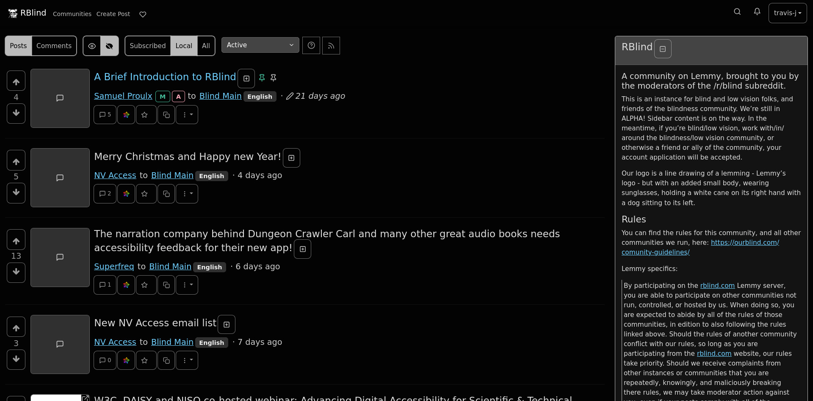

#### Post and Comments

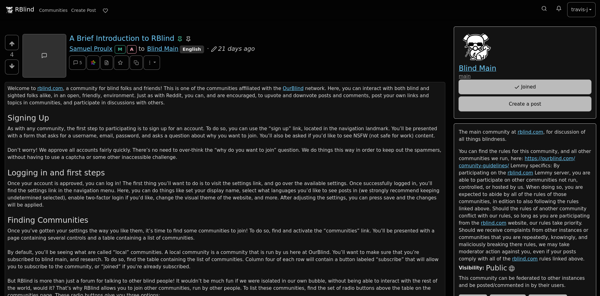

Comments are compact with enlarged buttons.

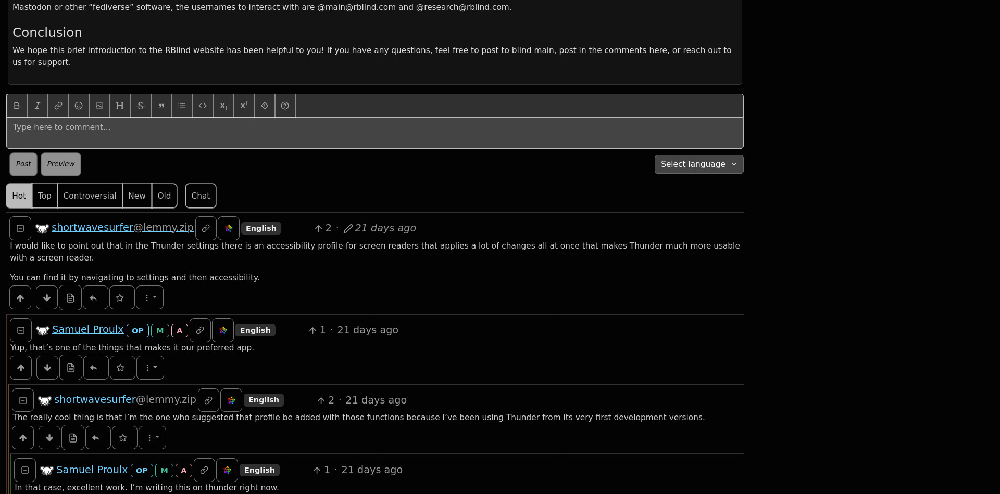

#### Forms

Checkboxes have an outline, even when disabled. The checkmark within the checkbox contrasts with its background. Important `danger` buttons have a light pink colour.

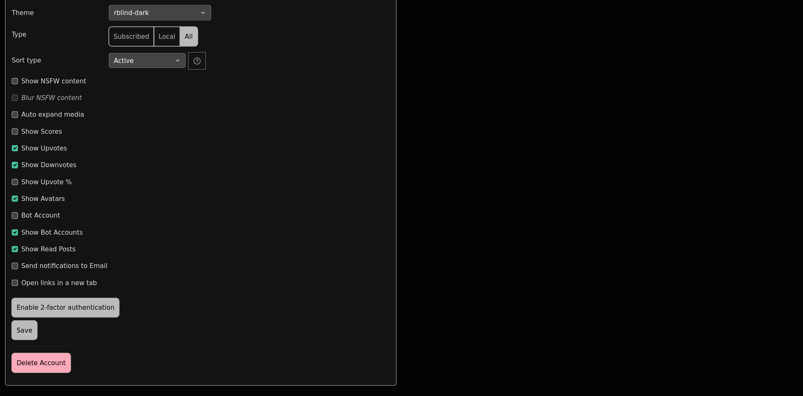

A close up of the Create Post text area. The Preview button is disabled and placeholder text is visible.

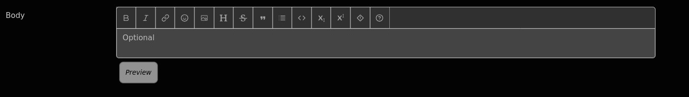

When text is entered into the field, the Preview button is no longer disabled.

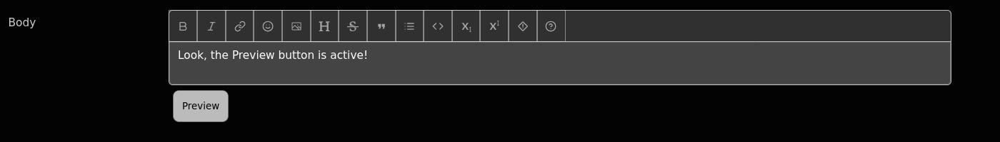

#### Focus

Focus indicators have been added to all buttons.

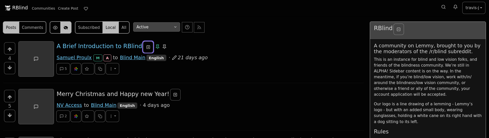

### RBlind Light Theme

The RBlind Light Theme is based on Litely Compact.

#### Home Feed

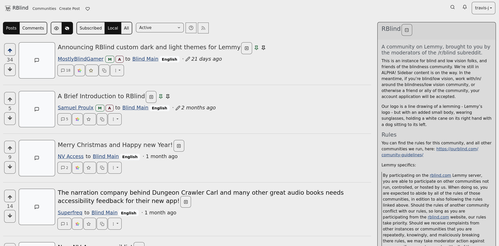

#### Post and Comments

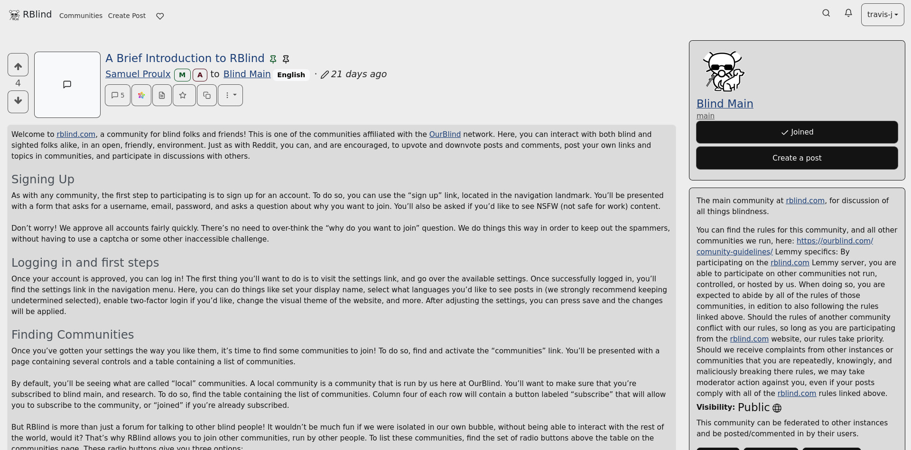

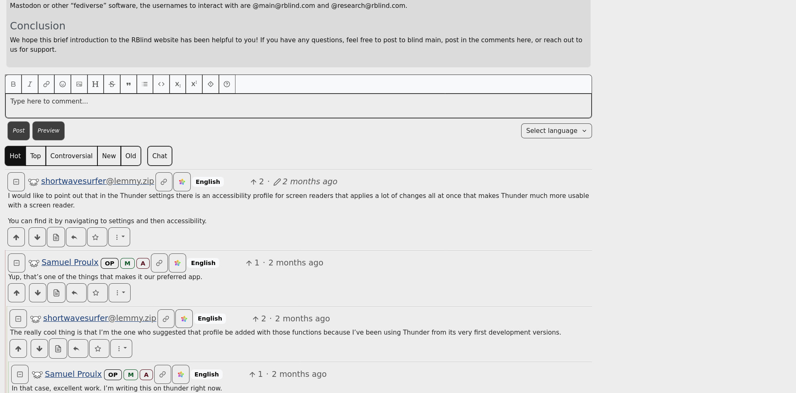

#### Forms

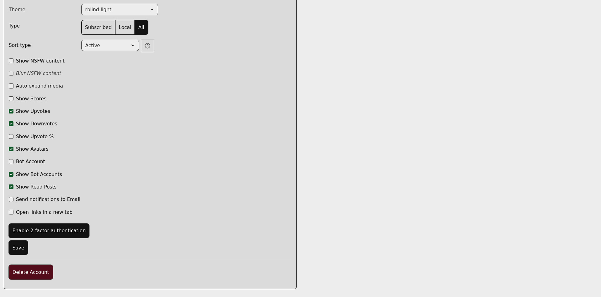

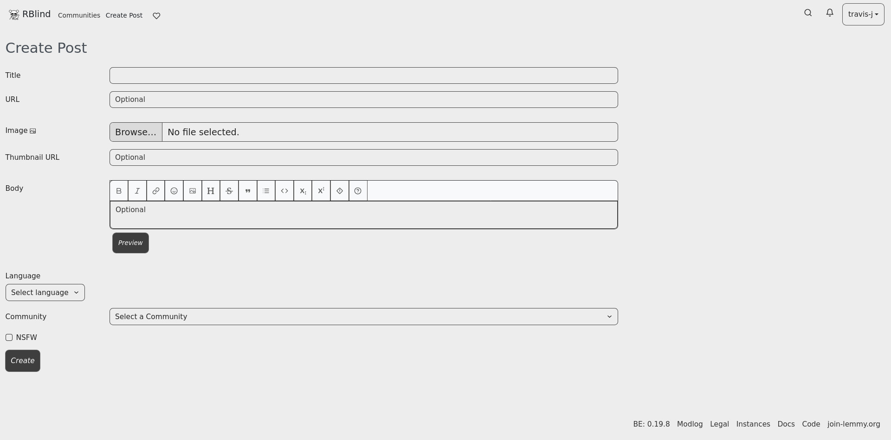

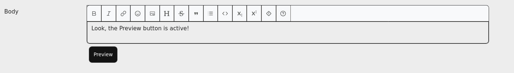

#### Focus

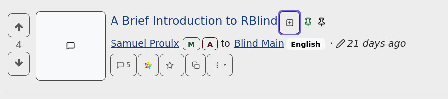

## Background

A representative from OurBlind contracted the freelance graphic designer Travis to develop a light and dark mode CSS theme. It aims to improve accessibility of the interface to the vision impaired and to make the design consistent with the OurBlind website.

OurBlind released an ad seeking designers within the OurBlind community to develop the CSS themes. The designer was chosen and themes were developed in December 2024.

The theme is being released to the public to get feedback from the OurBlind community, as well as making the source code available for others to adopt.

While developing these themes, a couple of accessibility issues with `lemmy-ui` were identified and will be reported to `lemmy-ui` for possible correction for all users.

## Features

These themes aim to improve the accessibility of the default Lemmy Compact theme and make them useful and appealing to the vision impaired and blind community.

### Text

- Larger text and icons for enhanced legibility
- High contrast text (most text contrast including text on buttons meets at least 7:1 or 4.5:1 for large text, icons or <abbr title="user interface">UI</abbr> elements are at least 3:1; [Contrast (Enhanced) (Level AAA)](https://www.w3.org/WAI/WCAG21/Understanding/contrast-enhanced), [Non-text Contrast (Level AA)](https://www.w3.org/WAI/WCAG21/Understanding/non-text-contrast))

### Links

- All links except post titles are underlined to help with identification [Consistent Identification (Level AA)](https://www.w3.org/WAI/WCAG21/Understanding/consistent-identification)
- All buttons have an outline (e.g. buttons under posts, post style options) to help with visual identification and separation
- All icon links have an outline to make them appear as UI elements (e.g. RSS link on the homepage), tooltips remain without outlines

### Buttons

- Buttons are larger (most 44px or larger, unless inline; others at least 24px; [Target Size (Level AA)](https://www.w3.org/WAI/WCAG22/Understanding/target-size-minimum.html) [Target Size (Level AAA)](https://www.w3.org/WAI/WCAG21/Understanding/target-size))
- Disabled buttons indicated with italic text instead of soley contrast
- Outlines on UI elements like buttons, radio buttons, checkboxes to help distinguish them from the background (**exception**: icons on the main navigation bar)
- A prominent focus indicator for all interactive elements including adding a focus indicator to elements not present in the default Lemmy Compact themes

### Layout

- Larger post preview images
- Improved contrast for the mini overlay on image thumbnails (icons in the top right of post previews to show post type, Default, Image, or Link)
- Reduced margins on medium resolutions
- Left-align forms and images attached to image posts
- Some forms take up more space on the screen

### Other

- A different colour for the Original Poster (OP) marker on comments
- Comment thread lines have better contrast against the background (note: if using a copy of lemmy-ui with the merged [Pull Request #2946](https://github.com/LemmyNet/lemmy-ui/pull/2946)), later than 19 February.

## Limitations

### Accessibility

#### External Style Sheets

If using an external style sheet to load these themes, note that theme compatibility depends on the default or selected theme on a Lemmy instance. If your Lemmy admin does not have the RBlind themes installed, we recommend for the best compability to log in to your Lemmy account, and set the default theme to:

- Darkly or Darkly Compact if you plan to load `RBlind-Dark.css` with an external style sheet
- Litely or Litely Compact if you plan to load `RBlind-Light.css` with an external style sheet

#### High Contrast Modes

To improve compability with alternate colour modes like High Contrast Mode, we have minimized the use of `!important` CSS variables. However, less `!important` variables can cause conflicts with some default Lemmy themes. Follow the advice above in [External Style Sheets](#external-style-sheets) to have the best experience with these themes.

The themes may not fully conform to the user's High Contrast modes or other custom style sheets, owing to the `!important` variables within the CSS theme to overwrite the Lemmy theme `!important` variables. This has been observed with hover effects and other colour styles.

#### Hover Effects

Because of the way `lemmy-ui` creates hover effects using `opacity` effects, the result is that hover effects are less obvious than they were previously due to the base contrast and opaque level being increased so elements like visited links and disabled buttons have improved contrast (sometimes people want to be able to read what a disabled button says in case they want to figure out how to activate it). However hover effects are decorative most of the time, so the colours weren't changed.

#### Existing Lemmy-UI Issues

Some accessibility issues and CSS cannot be corrected with CSS style sheets alone and require changes to the underlying Lemmy code. **Some** CSS-specific styling that cannot be changed without additional code or edits to `lemmy-ui` are listed in [Cannot Be Changed](#cannot-be-changed).

Styles that cannot be changed:

- inline CSS inserted manually or programmatically
- native HTML widgets whose default styles can only be edited with Javascript or are controlled by the browser

Issues that cannot be changed with CSS:

- [ARIA (MDN Web Docs)](https://developer.mozilla.org/en-US/docs/Web/Accessibility/ARIA)
- buttons missing programmatic labels
- missing landmarks
- non-accessible HTML code
- and more

Please report any accessibility issues with the underlying Lemmy codebase to [Lemmy UI Github Issues](https://github.com/LemmyNet/lemmy-ui/issues) tracker. To quick search `is:issue is:open accessibility OR accessible` see [Accessibility Issues Open on Lemmy UI's GitHub](https://github.com/LemmyNet/lemmy-ui/issues?q=is%3Aissue+is%3Aopen+accessibility+OR+accessible).

## License

This is open source software licensed under the [GNU General Public License (Version 3) (Markdown File)](./LICENSE.md).

If you prefer to read a HTML version you can read it at [GNU General Public License (HTML Stand Alone version)](https://www.gnu.org/licenses/gpl-3.0-standalone.html).

## Installation

### For Lemmy Administrators

Add the `.css` theme of your choosing to `/lemmy-ui/src/assets/css/themes` or the `lemmy-ui/extra_themes` folder. More information is available at [Theming Guide (Join-Lemmy)](https://join-lemmy.org/docs/administration/theming.html).

### For Lemmy Users

Copy the contents of the `.css` theme of your choosing to a browser add on like [Stylus](https://add0n.com/stylus.html). Remember to toggle it off when you visit other websites.

Follow the advice above in [External Style Sheets](#external-style-sheets) for best compatibility with these themes.

## For Designers

A guide for designers.

### Colours

The colours in the RBlind Lemmy Themes were a mixture of the following:

- the colours from the OurBlind website's light and dark modes (background colour, foreground colour, focus indicator)
- for dark mode, the Paul Tol Bright palette for the colour blind (luminance modified to improve contrast to the background)
- for light mode, the Paul Tol Muted palette for the colour blind (luminance modified to improve contrast to the background)
- for light mode, the `$danger` or `$red` colour is a much darker version of the Paul Tol Vibrant red since the hue was identifiable (for those with colour vision) rather than fuschia.
- the colour mixing that happens in the Bootstrap and upstream Lemmy `lemmy-ui` code that results in CSS `lighten` or `darken` or `opacity` operations being performed on colours to create `hover` or `focus` contrast effects and otherwise expand the colour palette. It would be labour intensive to manually override each colour so I aimed to provide a starting colour that was either light or dark enough that the CSS operations resulted in a sufficient level of contrast to the background.
- for shades of gray, `Inkscape`'s [Interpolate](https://inkscape.org/doc/tutorials/interpolate/tutorial-interpolate.html) function was used to develop 15 equal-step shades between the RBlind darkest colour and lightest colour. A subset of these colours were used to overwrite the existing gray colours used by the Compact theme so they produce a reasonable level of contrast. A slightly different set of shades were used for the Light and Dark theme but the order is reversed for the Light theme (the `$black` variable is actually `white` and the darkest grey on the Dark theme is the lightest grey on the light theme).

As a brief overview:

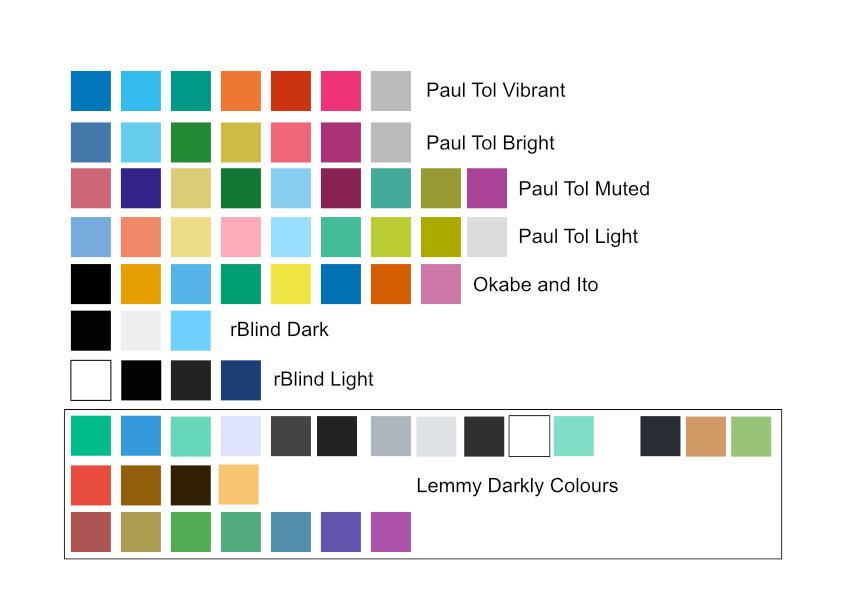

In the above image, from top to bottom, are the following colour swatches:

1. Paul Tol Vibrant
2. Paul Tol Bright
3. Paul Tol Muted
4. Paul Tol Light
5. Okabe and Ito
6. RBlind Dark
7. RBlind Light
8. Lemmy Darkly Colours (non-exhaustive)

For the new themes, the greys were defined first so all foreground colours and their contrast (text, buttons, UI) were in reference to those background colours.

The process was to edit the swatches in `Inkscape` before copying the RGBA swatches to a colour contrast analyser [Contrast (from Flathub)](https://flathub.org/apps/org.gnome.design.Contrast) to check against the background before replacing the Lemmy Darkly named variables. Once loaded in the browser, the Waterfox Inspect Accessibility Properties was also used to check text contrast.

For a reference to the Paul Tol colour palettes, see [Paul Tol's Qualitative Colour Schemes](https://personal.sron.nl/~pault/#sec:qualitative) post. Note that despite the colour palettes originally being designed for the colour blind, the luminance separation between colours within each scheme is not 3:1 contrast. In the context of the Lemmy theme, they don't need to be as the meaning of the colours is usually indicated in another way in the interface (with text).

If you are interested in learning more about the Okabe and Ito palette, you can see [Set of colors that is unambiguous both to colorblinds and non-colorblinds](https://jfly.uni-koeln.de/color/), we considered this colour palette but didn't end up using it due the lack of semantic colours (`success` usually green, `danger` usually red).

For more details about specific changes see [For Developers](#for-developers), but if you like colour codes, see [Colours](#Colours).

### Layout

We decided to base the theme on the Darkly and Litely Compact themes as these gave a good starting point for making use of the space on the screen. For users who might be using screen magnification, ensuring a more compact design with less inter-element or inter-column spacing means they do not have to scroll horizontally as much.

Other considerations:

- Increasing the size of text and buttons necessitated more room to hold those elements
- Further reducing the size of margins of the main content area additionally provides more space for the main content
- The padding between buttons (e.g. on the home page) is small to try prevent as many buttons from wrapping to the next line when the screen size is small

## For Developers

This section is a guide to producing the CSS in the RBlind Lemmy Themes and a code-specific overview of the visual changes.

It might be helpful to those creating themes or for people who would like to edit the existing RBlind themes.

### Requirements

- Local instance of `lemmy-ui` and/or `lemmy`, which use [Bootstrap 5 code](https://getbootstrap.com/docs/5.0/getting-started/introduction/)
- A copy of the `themes` folder from the [lemmy-ui Github themes folder](https://github.com/LemmyNet/lemmy-ui/tree/main/src/assets/css/themes) (**note** if making a local copy of all `lemmy-ui` files you have already done this)
- [Sass](https://sass-lang.com/) installation to process the `.scss` and `_variables.css` files
- A browser add on such as [Stylus](https://add0n.com/stylus.html) to transiently preview and apply CSS styles quickly during development

#### Local Development

If you plan to develop a theme locally, the Lemmy Docs has a section with instructions to install a local instance of Lemmy for [Local Development](https://join-lemmy.org/docs/contributors/02-local-development.html) so you can create mock up posts to test font styles in a controlled way, or use the Browser Inspector or Development Tools with minimal server delay. To do this, you will need to install both the Lemmy Frontend with the `lemmy-ui` folder and Lemmy Backend with the `lemmy` folder as described in the Local Development install instructions.

#### CSS Only

If you are using an operating system (OS) that does not allow you to make a Lemmy Instance or for some reason you can't use Sass or Bootstrap, you can still develop a theme by manually editing the RBlind output CSS files with Stylus.

The best option is to copy the upstream Bootstrap files and use `Sass` you can download `lemmy-ui` from the [lemmy-ui Github main](https://github.com/LemmyNet/lemmy-ui).

### Getting Started

If possible, build the Lemmy theme with Sass variables so the theme files are forward-compatible. This ensures the theme will adopt updates to the underlying Bootstrap theme and upstream `lemmy-ui` files.

#### Setting Up Your Working Directory

To work in the same directory as the `lemmy-ui` themes, set your `Sass` directory to `/lemmy-ui/src/assets/css/themes`.

To work locally in a different directory to the `lemmy-ui` files, copy the following files for `darkly-compact` **and** `litely-compact` and paste them in your chosen directory:

- `darkly-compact.css`
- `darkly-compact.scss`
- `_variables.darkly-compact.scss`
- `darkly.css`
- `darkly.scss`
- `_variables.darkly.scss`
- `litely-compact.css`
- `litely-compact.scss`
- `_variables.litely-compact.scss`
- `litely.css`
- `litely.scss`
- `_variables.litely.scss`

The Compact themes import theme and variable code from `darkly` or `litely`, so you need the files for both `darkly` and `darkly-compact` or `litely` and `litely-compact`.

You do not need the default `.css` files to build the RBlind Theme files but they can be a useful reference.

#### Paths

So the `sass` command will build, all paths need to be pointing to the correct locations.

If using a different directory to `lemmy-ui`, in line 5, `RBlind-Dark.scss` or `RBlind-Light.scss` change the relative location of the bootstrap theme to an absolute path to prevent errors:

From `../../../../node_modules/bootstrap/scss/bootstrap` to the location of your lemmy-ui folder `/lemmy-ui/node_modules/bootstrap/scss/bootstrap`

**IMPORTANT** This relative path will need to be reverted back to the original once you have finished your edits and it is uploaded to the `lemmy-ui` folder.

### RBlind Theme Files

Copy the following files to `/lemmy-ui/src/assets/css/themes` or your local directory.

#### Dark

- `RBlind-Theme.scss`
- `RBlind-Dark.scss`
- `_variables.RBlind-Dark.scss`

#### Light

- `RBlind-Theme.scss`
- `RBlind-Light.scss`
- `_variables.RBlind-Light.scss`

#### Building the output CSS file

Once you have made your desired changes to the `scss` files, run one of the following commands from the same directory as your theme and variable files using your terminal:

1. `sass RBlind-Light.scss RBlind-Light.css`
2. `sass RBlind-Dark.scss RBlind-Dark.css`

#### Order of Inheritance

The Theme-Name.scss files will import variables to be added to the output CSS file. It must load after the bootstrap import for styles to appear correctly.
If the bootstrap node_modules are loaded last, the upstream bootstrap `!important` styles will override the custom CSS classes.
The correct order of uploading files using the dark theme as an example `RBlind-Dark.scss` is:

1. `@import "variables.darkly-compact";`
2. `@import "variables.RBlind-Dark";`
3. `@import "../../../../node_modules/bootstrap/scss/bootstrap";`
4. `@import "RBlind-Theme.scss";` our custom code

Note that both Theme-Name.scss files themselves have a small amount of code afterward to redefine colours manually of SVG icons, which cannot use variables.

If you are loading the themes with an external style sheet and notice it has not applied correctly, try adding `@import "RBlind-Theme.scss` before the bootstrap import so it is loaded twice. When loaded as a local theme in Settings the additional import is not required.

### Theme Variables and Classes

All variables defined with the Sass variable indicator `$` or as CSS root variables (starting with `--`) are in `_variables.RBlind-Dark.scss` or `_variables.RBlind-Light.scss`.
All classes defined are in `RBlind-Theme.scss`.

#### Fonts

##### Font Family

- `$font-family-sans-serif` values changed to `Verdana, sans-serif`
- Added `$font-family-monospace` and changed to `"Courier New", monospace`

##### Headings

- `$h1-font-size` changed from `3rem` to `3.5rem`
- `$h2-font-size` changed from `2.5rem` to `3rem`
- `$h3-font-size` changed from `2rem` to `2.5rem`
- Added `h4-font-size` changed from `1.5rem` to `2rem`
- Added `h5-font-size` changed from `1.25rem` to `1.5rem`
- Added `h6-font-size` changed from `1rem` to `1.25rem`
- Overwrite `h6` value in posts since without this it is larger than `h5`. Added `.md-div h6 {
  font-size: 1.1rem;
}`

##### Size

- Increased the root font size from `100%` to `120%`. Added `$font-size-root` from `_variables.scss`.
- Increases the post author line size. Added `small, .small {
  font-size: 1.25rem !important;
}`

##### Paragraphs

- Increased the paragraph line spacing and between paragraph spacing. Added `.post-listing, p {
  line-height: 1.5em !important;
  margin-bottom: 1.5em !important;
}`
- Increase the line height of post cards as they are wrapped in `
` tags not `
` tags. Added:
  `.card-text {
  line-height: 1.5em;
}`

#### Links

##### Main

For links in the main area, ignoring the navigation bar and the footer.

- Add an underline text decoration to all links in the main area of the document. Added ` main a {
  text-decoration: underline;
}`
- Ensure that links inside buttons do not have an underline. Added `main a.btn {
  text-decoration: none;
}`
- Ensure links share the same link colour as the text. Add `.communities a, .person-listing a small {
  text-decoration-color: rgba(var(--bs-link-color-rgb), var(--bs-link-opacity, 1)) !important; // 
}`
- Make post title link underline and link post link underline the same as the text when visited. Added ` .post-title a:visited:not(:hover), .post-title + p a:visited:not(:hover) {
  text-decoration-color: var(--bs-gray) !important;
}`
- Remove the underline on post titles specifically both in the main feed and as metadata under link posts, as it is assumed users are familiar with the convention of clicking the title of a post to visit the post. Added `  .post-title a,
.post-metadata-card .card-body .card-title a {
  text-decoration: none;
}`

##### Navigation

- As outlines were added to icons that behaved as user interface elements to make them look more like buttons (see [Buttons (Sizes)](#Sizes)), navigation icon links have these outlines removed to remove clutter as it is assumed users understand that icons in the navigation bar are functional. Added `nav a.nav-link .icon {
  padding: 0.7rem 0.7rem !important;
}`
- Change navigation link spacing `nav ul#navbarLinks a.nav-link {
  margin-right: 0.75rem !important;
}`
- Increase the padding so the navigation links are above 44x44px but so the links are aligned with the Support Lemmy icon button and the instance banner. Added `nav ul#navbarLinks a.nav-link {
  padding: 0.9rem 0rem 0.1rem 0rem !important;
}`
- The Log In and Sign Up buttons are misaligned. This fixes them. Add `nav ul#navbarIcons a.nav-link[title=Login],
nav ul#navbarIcons a.nav-link[title="Sign Up"] {
  padding: 0.7rem 0rem 0.3rem 0rem !important;
}`
- Remove padding from the Support Lemmy icon link specifically so it does not become misaligned with other navigation links. Added `nav ul#navbarLinks li:last-child a.nav-link {
  padding: 0rem 0rem 0rem 0rem !important;
}`
- As icon buttons and links already have enough padding, make sure the navigation icon links only have enough margins to separate them from each other. Added `nav ul#navbarIcons a.nav-link {
  padding: 0rem 0rem 0rem 0rem !important;
  margin: 0rem 0.5rem 0rem 0rem !important;
}`
- Overwrite the colour of the focus indicator. Added `.btn:focus-visible {
  box-shadow: 0 0 0 0.25rem var(--rblind-focus-indicator) !important;
}`
- Overwrite the colour of the focus indicator on form controls. Added `.form-select:focus,
.form-control:focus {
  border-color: var(--rblind-focus-indicator);
  box-shadow: 0 0 0 0.25rem var(--rblind-focus-indicator) !important;
}`
- Ensure the navigation bar is correctly spaced. Added `nav ul#navbarLinks {
  margin-right: auto !important; 
}`
- Make the navigation link text smaller than the root font size. Added `nav ul#navbarLinks a.nav-link,
nav ul#navbarIcons a.nav-link[title=Login],
nav ul#navbarIcons a.nav-link[title="Sign Up"] {
  font-size: 0.9rem !important;
}`
- Align the Support Lemmy icon button (heart) with the rest of the navigation links. Added `nav ul#navbarLinks li:last-child a.nav-link {
  margin-top: 0.4rem;
}`
- Make sure the navigation bar wraps properly with the larger font sizes. Added `@media (min-width: 768px) {
  .navbar-expand-md .navbar-collapse {
    flex-wrap: wrap !important;
  }
}`
- Do the same with another part of the navigation. Added `@media (min-width: 768px) {
  .navbar-expand-md .navbar-nav {
    flex-wrap: wrap !important;
  }
}`

##### Skip Link

- Due to increasing button sizes, the Skip Link needs to be moved further up or the button will be partially visible before being brought into focus. Added `.skip-link {
  top: -60px;
}`
- Give the skip link button a focus indicator and underline the link upon focus. Offset the top and left sides by the width of the box shadow. Added `.skip-link:focus, .skip-link:focus-visible {
  top: 0.25rem;
left: 0.25rem !important;
text-decoration: underline;
box-shadow: 0 0 0 0.25rem var(--rblind-focus-indicator) !important;
}`

#### Images

- Images embedded in Image Post previews are left-aligned instead of right-aligned. Added `.offset-sm-3 {
  margin-left: 0% !important;
  margin-right: 25% !important;
}`
- Increase the size of the thumbnail in the home feed and add an outline to help distinguish it from the surroundings. Added `.thumbnail {
  width: 9rem;
  height: 9rem;
  outline: 1px solid var(--bs-gray-600);
}`

#### Layout

- Increased the spacing below the post title, as with larger outlined buttons the text and buttons are too close to the following line. Added `.post-title {
  margin-bottom: 0.5rem;
}`
- Reduced the spacing beneath the extra link after the post title on link posts. Added `.post-title + p.small {
  margin-bottom: 0.75rem !important;
}`
- Removed the white space margins on certain screen breakpoints. Added `.container-lg {
    margin-right: 0 !important;
    margin-left: 0 !important;
}` 
- Make forms take up more space on the screen so labels aren't flowing onto a new line. Added `@media (min-width: 1200px) {
.col-lg-6 {
  flex: 0 0 auto;
  width: 70% !important;
}
}`
- Left-align forms by removing the left margin. Added `.offset-lg-3 {
  margin-left: 0% !important; // default is 25%
}
`
- Make the main content area take up the whole screen at smaller screen sizes as the default behaviour of the compact layout adds white space. Added `@media (min-width: 992px) {
  .container-lg, .container-md, .container-sm, .container {
    max-width: 100% !important;
  }
}`
- Make navbar taller on small screens so border-box in the navbar-toggler does not overlap. Added `@media (max-width: 1200px) {
  #navbar {
    padding-top: 0.25rem !important;
  }
}`
- Ensure text reflow for very long usernames in the Sidebar. Added `.person-listing picture + span + small {
  word-break: break-all;
}`
- Prevent community names being broken up into letters on very small screens and improve sizing of the first column. Added `@media (max-width: 430px) {
    .community-link .overflow-wrap-anywhere {
	overflow-wrap: break-word;
    }
    .community-link picture, .community-link small.text-muted {
	display: block;
    }
    // try give more space in the table by breaking the headers instead
    #community_table th.text-right {
	overflow-wrap: anywhere;
    }
}`
- Stop flex display from making overflowing usernames from becoming stuck in their containers. Added `.person-listing {
  display: inline !important;
}`
- Prevent the toggle button in the Subscribed sidebar from overflowing from its container. Added `#sidebarSubscribedHeader {
  flex-wrap: wrap;
}`
- Reduce padding on posts. `.post-listing {
  padding: 0.1rem 0.25rem 0.1rem 0.25rem; // default value is 1.5rem
}`

#### Breakpoints

Due to the larger font and button sizes, the breakpoints were altered so resolutions suitable for smaller screens occur at larger screen sizes.

- `$grid-breakpoints: (
        xs: 0,
        sm: 768px,
        md: 992px,
        lg: 1200px,
        xl: 1900px,
        xxl: 2200px
);`
- `$container-max-widths: (
        sm: 960px,
        md: 1140px,
        lg: 1610px,
        xl: 2200,
        xxl: 2400
);`

#### Buttons

##### Sizes

- Changed the box size properties of icon links so the added padding (below) does not squish the icons to become invisible. Added `a.sort-select-icon .icon,
a[title=RSS] .icon,
a[title="sorting help"] .icon,
a.nav-link .icon {
  box-sizing: content-box !important;
}` Reported the lack of `icon-link` class to [Github issue #2894](https://github.com/LemmyNet/lemmy-ui/issues/2894)
- Rounded the edges of buttons. Added `.btn {
  border-radius: 0.5rem;
}`
- Increased the size of the button's icons. Added `.icon {
  height: 1em;
  font-size: 1.2em !important;
}`
- Increased the padding on buttons to increase the target area above 44px and add an outline to make clear buttons with icons are buttons and not images. Icons that behave as links also get an outline and are selected specifically by title (RSS and Sorting Help). this includes a lone button not styled with the .btn class on the inbox page and the navbar toggler icon (menu icon). Added `.btn-sm, .btn-group-sm > .btn, .btn,
a.sort-select-icon .icon,
a[title=RSS] .icon,
a[title="sorting help"] .icon,
.inbox .private-message ul.list-inline.mb-0.text-muted.small li:last-child .icon,
.navbar-toggler .icon,
#navMessages {
  padding: 0.7rem 0.7rem !important;
  outline: 1px solid rgba(var(--gray-200-rgb), 0.5) !important;
}` Missing `.btn` class on Reveal/Hide icon reported to [Github issue #2895](https://github.com/LemmyNet/lemmy-ui/issues/2895)
- Fix box model of the icon in the inbox and round the outline and the navbar-toggler which is also missing a btn style. Added `.inbox .private-message ul.list-inline.mb-0.text-muted.small li:last-child .icon,
.navbar-toggler .icon {
  box-sizing: content-box;
  border-radius: var(--bs-border-radius);
}` Missing `.btn` class on burger menu / navbar-toggler button reported to [Github issue #2893](https://github.com/LemmyNet/lemmy-ui/issues/2893)
- Remove the outline from the navbar-toggler .icon. Added `.navbar-toggler .icon {
  outline: 0rem !important;
}`
- Fix colour inheritance problem with the icon on the inbox page (show/hide svg which is missing a .btn class). Color is determined by fill: currentColor which points to black on this particular icon for some reason. Added `.inbox .private-message ul.list-inline.mb-0.text-muted.small li:last-child .icon {
  color: rgba(var(--gray-200-rgb), 0.75);
}`
- Increased the size of icons when they behave as links. Added `.btn-sm .icon, .btn-group-sm > .btn .icon, .btn .icon,
a.sort-select-icon .icon,
a[title=RSS] .icon,
a[title="sorting help"] .icon,
nav a.nav-link .icon {
  height: 1em;
  font-size: 1.2em !important;
}` **Note** This is dissociated from the above change to `.icon` as this class is shared by buttons without icons and buttons with icons. If padding was added to all `.icon`s, buttons containing icons would have a duplicate amount of padding.

##### Spacing

The following selectors are to specific some buttons, but not others (e.g. post style buttons).

###### Margins

- Increased the spacing between buttons for the comment and post title buttons. Added `.comment-bottom-btns .btn,
.post-title + div + div .btn,
.post-title + p + div + div .btn,
.comment .btn {
  margin-right: 0.25rem;
}`
- Increase spacing to the left of specific buttons:

1. Those following badges (e.g. <abbr title="Original Poster">OP</abbr>, <abbr title="Moderator">M</abbr>, or <abbr title="Administrator">A</abbr>) on the post author line
2. Those following the post author when there are no badges
3. The button following the post title; by adding: `a.person-listing ~ span + .btn,
a.person-listing + .btn,
.post-title .btn {
  margin-left: 0.25rem;
}`

- Increased the spacing below the author line so buttons below do not touch the text descenders. Added `.post-title,
.post-title + div,
.post-title + p + div {
  margin-bottom: 0.5rem !important;
}` (**Note** If you try to apply this to `small, .small` it will apply to `.icon`)
- Add spacing above and below the vote number. Added `.post-score {
  margin-top: 0.25rem;
  margin-bottom: 0.25rem;
}`
- Align the vote up button with the top of the container by reducing the top margin from `-6.5px` to `0px`. Added `.vote-bar {
  margin-top: 0px;
}`
- Add spacing above and below posts. Added `.post-container {
  margin-top: 1rem;
  margin-bottom: 1rem;
}`
- Increase the spacing between wrapping list buttons in the sidebar. Added `.community-sidebar ul li .btn {
  margin-bottom: 0.25rem;
}`

###### Padding

- Reduce the spacing between the upvote and downvote widget next to post listings in the home feed. Added `article.post-container > .flex-grow-0 {
  padding: 0.25rem;
}`
- Remove padding from the navbar toggler. Must have `!important`. There seem like there are two navbar Messages, one for desktop and one for mobile, so need to overwrite the styling of the mobile one. Navmessages has multiple instances of padding. Added `.navbar-toggler,
#navMessages a,
#navMessages {
  padding: 0rem !important;
  outline: 0rem !important;
}`

###### Functionality

- Gave icon links and the navbar toggler a focus indicator to match the focus indicator of buttons. Added `a.sort-select-icon:focus svg,
a[title=RSS]:focus svg,
a[title="sorting help"]:focus svg,
.navbar-toggler:focus {
  box-shadow: 0 0 0 0.25rem var(--rblind-focus-indicator) !important;
}`
- Made so the down vote icon changes colour when the button area is hovered, not just the icon. Made this happen when the button is focused as well. Added `.downvote:hover, .btn:hover .downvote, .btn:focus .downvote,
.downvote:focus, .btn:focus .downvote, .btn:focus .downvote {
  color: var(--bs-danger);
}`
- Same as above but with the upvote button. Added `.upvote:hover, .btn:hover .upvote, .btn:focus .upvote,
.upvote:focus, .btn:focus .upvote, .btn:focus .upvote {
  color: var(--bs-info);
}`
- Give unselected tabs (like Comment) the same focus outline as other buttons. Added `.btn-check:focus-visible + .btn {
  box-shadow: 0 0 0 0.25rem var(--rblind-focus-indicator) !important;
}`
- Change the focus outline of secondary buttons like Next on the homepage to have the same colour as other buttons. Added `.btn-secondary:focus-visible {
  box-shadow: 0 0 0 0.25rem var(--rblind-focus-indicator) !important;
}`
- Change the colour of the focus indicator on Languages select cross button on Create Community page. Added `.btn-outline-secondary:focus {
  box-shadow: 0 0 0 0.25rem var(--rblind-focus-indicator) !important;
}`
- Make the currently selected tab focus indicator the same colour as other buttons. Added `.btn-check:checked:focus-visible + .btn {
  box-shadow: 0 0 0 0.25rem var(--rblind-focus-indicator) !important;
}`

#### Forms

- Change the cursor to a pointer when interacting with a label with a checkbox. This is to try compensate for how some checkboxes are dissociated from their labels (On Create Community page, has a legend `Only moderators can post to this community` with a single checkbox). Added: `.form-check > * {
  cursor: pointer;
}`
- Disable cursor change to pointer when buttons are disabled. Added `.form-check[disabled] > * {
  cursor: default;
}`

#### Colours

These colours are referring to the Dark theme. The Light theme has these values replaced with different values.

##### Root

Root variables are defined in the `_variables` `scss` file.

##### Grays

- Change `$white` (bs-white, bs-emphasis, bs-table, border-white, text-light): `#eeeeeeff;`
- Change `$gray-200` (secondary button background) ` #ddddddff;`
- Change `$gray-300`(bs-dark, bs-dark-emphasis and more): ` #ccccccff;`
- Change `$gray-400` (bs-button-bg, and other button styles, input group text (defined in the class by hex code not variable, bs button disabled, etc): `#bbbbbbff;`)
- Change `$gray-600` (blockquote footer, disabled form, disabled button, dropdown header colour, bs-gray): `#676767ff;`
- Change `$gray-700` (card header background): `#242424ff;`
- Change `$gray-800` (card background, bs-light): `#131313ff;`
- Change `$gray-900` (background colour): `#030303ff;`
- Add `--gray-200-rgb: 221, 221, 221;` to use the `gray-200` colour with opacity arguments with `rgba`

##### Hues

For the dark theme, the colours are based on Paul Tol's Light palette except for `$cyan` which is an rBlind colour.

- Change `$blue` `#77aaddff;`
- Change `$red` (bs-danger, danger red):`#ffaabbff;`
- Change `$yellow` (bs-alert): `#eedd88ff;`
- Change `$green` (form check input background and border): `#44bb99ff;`
- Change `$cyan` (bs-info): `#6fcfffff;`
- Added `$orange` (for Atom highlighting): `#ee8866ff;`
- Added `$teal` (for Atom highlighting): `bbcc33ff;`

##### Links

- Make links `cyan` instead of `success`. Changed `$link-color: $cyan;`
- Override :dark or :light theme link colour variables. Added `a {
color: var(--bs-info);
}`
- Fix bug in light mode where post titles and links become invisible due to a white color. Added `.link-dark {
  color: var(--bs-gray-200) !important;
    text-decoration-color: RGBA(var(--bs-gray-200), var(--bs-link-underline-opacity, 1)) !important; // need to define text-underline too
}`
- Fix text decoration contrast on light mode `.link-dark:hover, .link-dark:focus {
  text-decoration-color: var(--bs-gray-200) !important;
}`
- Change the link primary colour only for post titles (pinned posts have the .link-primary class while non-pinned posts have .link-dark). Added `.post-title .link-primary {
  color: var(--bs-info) !important;
}`

##### Buttons and UI Elements

- Change check in checkbox to black instead of white due to colour contrast issues. Added `$form-check-input-checked-color: $gray-900;`
- Make custom code yellow instead of a poorly contrasting red (note: may be overwritten by Atom variables): `$code-color: $yellow;`
- Changed the background color of disabled buttons and made the text italic as an additional visual indicator. Added `
.btn:disabled, fieldset:disabled .btn {
  font-style: italic;
  background-color: var(--bs-gray-200);
}`
- Add variables to define disabled buttons (redundant) and change opacity to `0.8` for light mode only. `$btn-disabled-color: $gray-200;
$btn-disabled-opacity: 0.65; // default`
- Make disabled checkbox labels italic and improve colour contrast. Added `.form-check-input[disabled] ~ .form-check-label, .form-check-input:disabled ~ .form-check-label {
  cursor: default;
  opacity: 0.8;
  font-style: italic;
}`
- Gave checkboxes a light outline. This is the lowest colour you can go without the disabled checkbox outline style dropping below 3:1 contrast. `$border-color: $gray-500 !important;`
- Give form controls an outline to meet 3:1 contrast requirement. Added `.form-control {
  border: var(--bs-border-width) solid var(--bs-gray-600); // 100 higher than the checkbox outline - may be too low when disabled
}`
- Make placeholder colours opaque since many placeholders have multiple instances of reducing opacity. Added `.placeholder {
  opacity: 1; // default is 0.5
}`
- Give placeholder text a higher contrast to the background. Added `.form-control::placeholder {
  color: var(--bs-gray-500);
}`
- Fix poor contrasting buttons on Light mode. Added `.card .btn-outline-dark {
  color: var(--bs-gray-200) !important;
}`
- Fix poor contrasting tabs in Administrator Settings on Light mode. Added `.nav-link:hover, .nav-link:focus {
  color: var(--bs-gray-200);
  border-color: var(--bs-white) !important;
}`
- Make the down arrow on the dropdown select buttons white instead of gray. Added `.form-select {
background-image: url("data:image/svg+xml,%3csvg xmlns='http://www.w3.org/2000/svg' viewBox='0 0 16 16'%3e%3cpath fill='none' stroke='white' stroke-linecap='round' stroke-linejoin='round' stroke-width='2' d='m2 5 6 6 6-6'/%3e%3c/svg%3e");
}`
- Fix colour contrast issue on Browse... File selection button. Added `.form-control::file-selector-button {
  background-color: var(--bs-gray-800);
}`
- Remove the opacity from the mini overlay so the icons have higher contrast. Added `.mini-overlay {
  background: var(--bs-gray-900);
  background-color: var(--bs-gray-900);
}`
- Add a variable to change post and comment divider color: `--divider: var(--bs-gray-700);`
- Improve the contrast of the post dividers. Added: `hr {
    border-top: var(--bs-border-width) solid var(--divider);
    opacity: 1;
}`
- Improve the contrast of comment dividers. Added: `li.comment article.comment-node.border-top {
    border-top-color: var(--divider) !important;
}`
- Make the <abbr title="Original Poster">OP</abbr> comment marker to be a light colour (so it does not share the same colour as links). Added: `span[aria-label=creator] {
    color: var(--bs-white) !important;
    border-color: var(--bs-white) !important;
}`

##### Hover

Invert the colours on dropdown menu hovers or focus.

- Added `$dropdown-link-active-color: $gray-900;`
- Added `$dropdown-link-active-bg: $gray-200;`
- Added `$dropdown-link-hover-bg: $gray-200;`
- Added `$dropdown-link-hover-color: $gray-900;`
  Change link visited colours for post titles.
- Change visited link colour due to low contrast default is --bs-gray. Added `.post-title a:visited:not(:hover) {
  color: var(--bs-gray-500) !important;
}`
- Change hover link colours. Added `.link-dark:hover, .link-dark:focus,
.link-primary:hover, .link-primary:focus {
  color: var(--bs-gray-200) !important;
}`
- Improve colour contrast on navigation links when not hovered. Added `.navbar,
.nav-link {
color: rgba(var(--bs-white-rgb), 0.8);
}`
- Fix the hover style on the Browse... File selection button. Added `.form-control:hover:not(:disabled):not([readonly])::file-selector-button {
  background-color: var(--bs-gray-700);
}`

##### Focus

- Added ` --rblind-focus-indicator: #7764d8;`
- Added `$box-shadow: 0 0 0 0.25rem var(--rblind-focus-indicator) !important;`
- Added `$focus-ring-color: var(--rblind-focus-indicator);`

##### Layout

- Fix colour contrast on the Mark class. Added `.mark {
  color: var(--bs-white);
  background-color: var(--bs-gray-800);
}`
- Darken the card background and lighten text (used behind post meta summaries and side panel text area) `.card, .card-body {
  color: var(--bs-gray-200) !important;
  background-color: var(--bs-gray-800) !important;
  border-radius: var(--bs-border-radius);
}`
- Make table colors visible. Added: `$table-color: $gray-200;`

##### Atom

Atom styles control the colours within `<code>` snippets as a part of syntax highlighting. These variables were borrowed from a different style sheet (Atom One: `/lemmy-ui/dist/assets/css/code-themes`). They are loaded by Lemmy as a separate style sheet, but we can overwrite them.

- Added `pre code.hljs {
  display:block;
  overflow-x:auto;
  padding:1em
}`
- Added `code.hljs {
  padding:3px 5px
}`
- Added `.hljs {
  color: var(--bs-gray-200) !important;
  background: var(--bs-black) !important;
}`
- Added `.hljs-comment,
.hljs-quote {
  color: var(--bs-gray-600) !important;
  font-style:italic
}`
- Added `.hljs-doctag,
.hljs-formula,
.hljs-keyword {
  color: var(--bs-teal) !important;
}`
- Added `.hljs-deletion,
.hljs-name,
.hljs-section,
.hljs-selector-tag,
.hljs-subst {
  color:var(--bs-red) !important;
}`
- Added `.hljs-literal {
  color:var(--bs-cyan) !important;
}`
- Added `.hljs-addition,
.hljs-attribute,
.hljs-meta .hljs-string,
.hljs-regexp,
.hljs-string {
  color: var(--bs-green) !important;
}`
- Added `.hljs-attr,
.hljs-number,
.hljs-selector-attr,
.hljs-selector-class,
.hljs-selector-pseudo,
.hljs-template-variable,
.hljs-type,
.hljs-variable {
  color: var(--bs-orange) !important;
}`
- Added `.hljs-bullet,
.hljs-link,
.hljs-meta,
.hljs-selector-id,
.hljs-symbol,
.hljs-title {
  color: var(--bs-blue) !important;
}`
- Added `.hljs-built_in,
.hljs-class .hljs-title,
.hljs-title.class_ {
  color: var(--bs-yellow) !important;
}`
- Added `.hljs-emphasis {
  font-style:italic;
}`
- Added `.hljs-strong {
  font-weight:700;
}`
- Added `.hljs-link {
  text-decoration:underline;
}`
- Give the text `!main@blind.com` `<code>` in the sidebar during log out the same background as `.hljs` for code. Added `code.user-select-all {
  background-color: var(--bs-black);
}`

#### Light and Dark Modes

Within the default themes Darkly and Litely there are `data-bs-theme` toggles for a `light` and `dark` mode, as specified within Bootstrap ([Color modes](https://getbootstrap.com/docs/5.3/customize/color-modes/)).

To try disable unpredictable behaviour from colour mode switching, the variables toggling the light and dark mode have been changed for the `RBlind-Light` and `RBlind-Dark` themes.

- Added `$enable-dark-mode: true; $enable-light-mode: false;` to `_variables.RBlind-Dark.scss`
- Added `$enable-dark-mode: false; $enable-light-mode: true;` to `_variables.RBlind-Light.scss`

#### Cannot be changed

Below are those with no known solution, those with solutions are in Closed issues.

- The dropdown box Registration Mode on Site Settings cannot be edited by changing the padding values in `select option`, Javascript is required to change as the styling of the options is determined by the browser
- The Rate Limit change up and down buttons within the input box cannot be changed and requires Javascript. The following code does not work `input#rate-limit::after {
 min-height: 44px;
 min-width: 44px;
}`
- Cannot change the background colour of currently selected `select option` in the Language Select in Settings which leads to a low contrast colour combination.

##### Closed issues

- Remove inline styles from Allowed Instances and Blocked Instances buttons on the Site Configuration. [Github issue #2888](https://github.com/LemmyNet/lemmy-ui/issues/2888)
- Post nesting left-border width and colour is now defined in CSS. [Github issue #2889](https://github.com/LemmyNet/lemmy-ui/issues/2889), [#2890](https://github.com/LemmyNet/lemmy-ui/issues/2890)

#### Other

As a side note, there is an in-built function to automatically generate contrast pairs with a minimum of 3:1. I did not try changing this since I manually determined high contrasting pairs depending on context (not all colours need to be high contrasting pairs, but those for text should be).

The file `_variables.sccs` has the arguments:

- `$link-decoration: none;`
- `$min-contrast-ratio: 3;`
- `$font-size-root: 100%;`

`$min-contrast-ratio` is not a SCSS variable but is read by a bootstrap function `color-contrast()` in `/lemmy-ui/node_modules/bootstrap/scss/_functions.scss`.

## For Contributers

This project is open to contributions and suggestions. Please submit a post in the discussion forum so everyone can see it.

This document was authored by the designer, Travis Jeans. To contact him directly, please email hello@futurehorizondesign.net.au.

## About The Repositories

The repository is simultaneously maintained on Github and Codeberg.

It is uploaded to Github for accessibility reasons.

As Codeberg is an open source platform, it is more suitable for copyleft licenses like the ones we have used. For more discussion about this issue please read [Please don't upload my code to Github](https://nogithub.codeberg.page/).

The designer would prefer contributors to use Codeberg as the primary platform, but Github is provided as an accessible alternative in case Codeberg isn't suitable. Both forums will be monitored.
